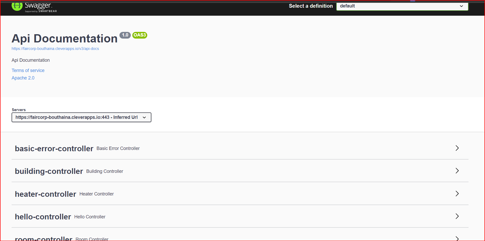

<div id="top"></div>


<!-- PROJECT LOGO -->
<br />
<div align="center">
  <a href="https://github.com/bouthaina-hrour/spring-">
    
  </a>

  <h3 align="center">my readme </h3>

 
</div>


<!-- TABLE OF CONTENTS -->
<details>
  <summary>Table of Contents</summary>
  <ol>
    <li>
      <a href="#about-the-project">About The Project</a>
      <ul>
        <li><a href="#built-with">Built With</a></li>
      </ul>
    </li>
    <li>
      <a href="#getting-started">Getting Started</a>
      <ul>
        <li><a href="#prerequisites">Prerequisites</a></li>
        <li><a href="#installation">Installation</a></li>
      </ul>
    </li>
    <li><a href="#usage">Usage</a></li>
    <li><a href="#contributing">Contributing</a></li>
    <li><a href="#license">License</a></li>
    <li><a href="#contact">Contact</a></li>
  </ol>
</details>


<!-- ABOUT THE PROJECT -->
## about the project
* what is faircorp


Faircorp api is an application which is able to manage the building , its rooms ,windows , and heaters.
* how does faircorp work

- the building has an outside temperature, and rooms
- each room has zero or more heaters, has zero or more windows, a name, a floor, a current temperature, a target temperature.
- each heater has a name, an on or off status, possibly a power.
- each window has a name, an a status open or closed

<p align="right">(<a href="#top">back to top</a>)</p>


### Built With

These are major frameworks/libraries used to bootstrap the project. 

* [gradle](https://gradle.org/)
* [Spring](https://spring.io/projects/spring-boot)

<p align="right">(<a href="#top">back to top</a>)</p>


<!-- GETTING STARTED -->
## Getting Started


To get a local copy up and running follow these simple steps.

### Prerequisites

This is an example of how to list things you need to use the software and how to install them.
* java (if you don't have it ) 
  ```sh
  sudo apt install openjdk-8-jdk
  ```
* you need to install gradle 

### Installation

1. Clone the repo
   ```sh
   git clone https://github.com/bouthaina-hrour/spring-.git
   ```
2. go into spring- directory
   ```sh
   cd spring-
   ```
3. To run the application, run the following command in a terminal window (in the complete) directory:
   ```sh
   ./gradlew bootRun
   ```
4. to build this application run 
   ```sh
   ./gradlew build
   ```
5. to run tests: 
   ```sh
   ./gradlew test
   ```

<p align="right">(<a href="#top">back to top</a>)</p>


<!-- USAGE EXAMPLES -->
## Usage

To use the api after running it , you can go to the swagger to do http request (GET POST PUT DELETE)




Here is an example :


<p align="right">(<a href="#top">back to top</a>)</p>


<!-- CONTRIBUTING -->
## Contributing

Contributions are what make the open source community such an amazing place to learn, inspire, and create. Any contributions you make are **greatly appreciated**.

If you have a suggestion that would make this better, please fork the repo and create a pull request. You can also simply open an issue with the tag "enhancement".
Don't forget to give the project a star! Thanks again!

1. Fork the Project
2. Create your Feature Branch (`git checkout -b feature/AmazingFeature`)
3. Commit your Changes (`git commit -m 'Add some AmazingFeature'`)
4. Push to the Branch (`git push origin feature/AmazingFeature`)
5. Open a Pull Request

<p align="right">(<a href="#top">back to top</a>)</p>


<!-- LICENSE -->
## License

Distributed under the MIT License. See `LICENSE.txt` for more information.

<p align="right">(<a href="#top">back to top</a>)</p>


<!-- CONTACT -->
## Contact

HROUR bouthaina - [linkedin account : bouthaina-hrour](https://www.linkedin.com/in/bouthaina-hrour-68801019a/) 

Project Link: [https://github.com/bouthaina-hrour/spring-](https://github.com/bouthaina-hrour/spring-)

<p align="right">(<a href="#top">back to top</a>)</p>


